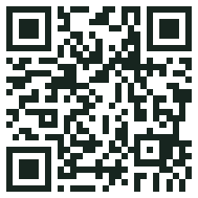
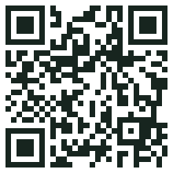

# AWS Community Day Argentina 2026 - StockLens

Repositorio de demo para la charla: crear una aplicacion con IA y evolucionarla
hacia una arquitectura AWS.

## Apps

- `StockLens_v01/`: app admin/local con inventario, QR, fotos y movimientos.
- `StockLens_v02/`: version serverless con `front_web`, `front_mobile`, `backend`, `terraform` y CI/CD OIDC.
- `StockLens_v04/`: demo tecnica con GitHub Actions, OIDC, Amazon Bedrock, Playwright y evidencia.
- `StockLens_v05/`: demo de producto mobile-first para catalogar objetos de casa/galpon y prepararlos para vender.
- `StockLens_ppt/`: material de presentacion.
- `personal-wallet/`: idea separada de wallet personal consolidada.

## Aplicaciones Desplegadas

<table>
  <tr>
    <td align="center" width="25%" style="padding: 18px;">
      
      <br />
      <strong>v04 Web/admin</strong>
      <br />
      <a href="https://stock-v4.lens.glaciar.org">stock-v4.lens.glaciar.org</a>
    </td>
    <td align="center" width="25%" style="padding: 18px;">
      
      <br />
      <strong>v04 Mobile campo</strong>
      <br />
      <a href="https://mobile-v4.lens.glaciar.org">mobile-v4.lens.glaciar.org</a>
    </td>
    <td align="center" width="25%" style="padding: 18px;">
      
      <br />
      <strong>v04 Admin evidencia</strong>
      <br />
      <a href="https://admin-v4.lens.glaciar.org">admin-v4.lens.glaciar.org</a>
    </td>
    <td align="center" width="25%" style="padding: 18px;">
      
      <br />
      <strong>v05 Mobile producto</strong>
      <br />
      <a href="https://mobile-v5.lens.glaciar.org">mobile-v5.lens.glaciar.org</a>
    </td>
  </tr>
</table>

Estado verificado el 2026-09-07:

- `stock-v4.lens.glaciar.org`: HTTP 200.
- `mobile-v4.lens.glaciar.org`: HTTP 200.
- `mobile-v5.lens.glaciar.org`: HTTP 200.
- `admin-v4.lens.glaciar.org`: pendiente de resolver DNS/aplicar infraestructura v4 admin.

## Documentacion

- `README_MAIN.md`: guia principal de la charla.
- `STRUCTURE_OVERVIEW.md`: mapa de carpetas y versiones.
- `README_USE_CASES.md`: motivacion y casos de uso de edificio/casa.

## Ejecutar StockLens v01

```bash
cd StockLens_v01
npm install
npm run dev
```

## Ejecutar StockLens v02

```bash
cd StockLens_v02/front_mobile
npm install
npm run dev
```
